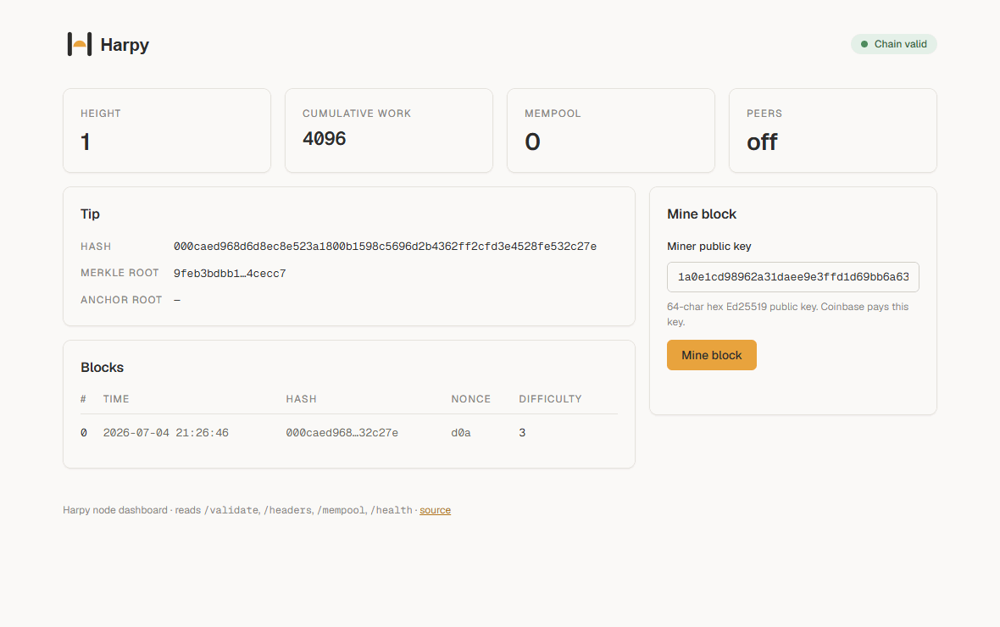
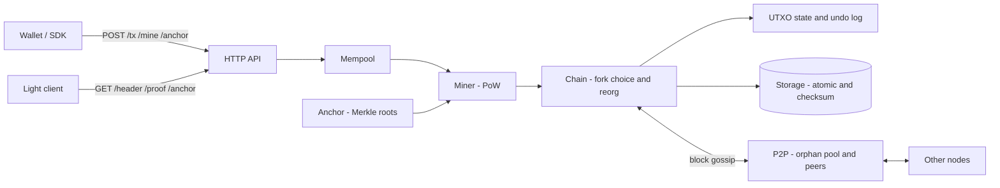

<div align="center">

<picture>
  <source media="(prefers-color-scheme: dark)" srcset="assets/harpy-logo-dark.svg">
  
</picture>

**A proof-of-work blockchain in Crystal — UTXO transactions, P2P gossip, reorgs, and a Merkle anchoring layer, built for learning without cutting corners.**

[](https://crystal-lang.org)
[](#license)
[](docs/SELFISH_MINING.md)
[](docs/STATE_MODEL.md)
[](spec/tla/README.md)
[](#status)

**[🚀 Quick start](#quick-start)** · **[📖 Guided demo](docs/DEMO.md)** · **[⚓ Anchoring](#anchoring-hash-on-chain-data-off-chain)** · **[📚 Documentation](#documentation)**



*The built-in dashboard at `/dashboard` — mining three blocks against a live node.*

</div>

Harpy is a from-scratch blockchain node — signed UTXO transactions, a mempool, difficulty retargeting, cumulative-work fork choice with reorgs, peer-to-peer block gossip, and a hash-anchoring/verification layer with SPV light-client proofs. It's an **educational** project (single operator, not mainnet-grade), but every layer is built and tested the way a real node would be: adversarial specs, a formally model-checked consensus core, and a chaos harness. Named after **Harpocrates**, the Greek god of silence.

> **What it is not:** production financial infrastructure. No privacy, no external audit, no economic guarantees. Run it to *understand* how a chain works — see [docs/THREAT_MODEL.md](docs/THREAT_MODEL.md) for the honest security posture.

---

## Features

**Transactions & cryptography**
- 💸 **UTXO model** — signed inputs/outputs, coinbase with 100-block maturity, fees, double-spend prevention ([STATE_MODEL.md](docs/STATE_MODEL.md))
- 🔑 **Ed25519 signatures** with a **crypto-agile** address format (versioned, algorithm-tagged, checksummed) so post-quantum schemes are additive, not breaking ([POST_QUANTUM_MIGRATION.md](docs/POST_QUANTUM_MIGRATION.md))
- 🧾 **Mempool** with validation, fee ordering, and conflict rejection

**Consensus**
- ⛏️ **Proof-of-work** with configurable difficulty and time-based **retargeting**
- 🏋️ **Cumulative-work fork choice** — heaviest chain wins, not longest ([SELFISH_MINING.md](docs/SELFISH_MINING.md), [CONFIRMATION_DEPTH.md](docs/CONFIRMATION_DEPTH.md))
- 🔁 **Reorgs** with per-block undo logs for exact UTXO rewind

**Networking**
- 🌐 **P2P block gossip** with an orphan pool and multi-node convergence ([P2P.md](docs/P2P.md))
- 🛡️ **Network hardening** — peer caps, misbehavior banning, eclipse-attack countermeasures ([SYBIL_RESISTANCE.md](docs/SYBIL_RESISTANCE.md), [ROUTING_PARTITION.md](docs/ROUTING_PARTITION.md))

**Storage & integrity**
- 💾 **Atomic writes** (temp-file + rename) behind a swappable storage backend
- 🔒 **Checksum envelope** — bit-rot / tamper detected on load, before validation ([STORAGE_BACKENDS.md](docs/STORAGE_BACKENDS.md))

**Verification layer**
- ⚓ **Merkle anchoring API + SDK** — commit external record hashes on-chain, get inclusion proofs ([AUDIT_LOG_ANCHORING.md](docs/AUDIT_LOG_ANCHORING.md))
- 🪶 **SPV light clients** — verify inclusion from a block header + Merkle path, no full node

**Assurance**
- ✅ **TLA+ consensus spec, model-checked** with TLC — the fork-choice safety property holds across the state space ([spec/tla](spec/tla/README.md))
- 🌪️ **Chaos harness** — partition/heal, crash/restart, and Byzantine-block fault injection ([spec/chaos_harness_spec.cr](spec/chaos_harness_spec.cr))
- 🔐 **Opsec docs** — node hardening, key rotation, threshold multisig design ([NODE_HARDENING.md](docs/NODE_HARDENING.md))

## Quick start

**Prerequisites:** [Crystal](https://crystal-lang.org/install/) ≥ 1.12. On Windows: `winget install CrystalLang.Crystal`, enable **Developer Mode** (for `shards` symlinks), restart your terminal, or run `.\scripts\setup.ps1`.

```bash
shards install
crystal run src/harpy.cr          # starts an HTTP node on 127.0.0.1:3000
```

Then open **http://127.0.0.1:3000/dashboard** — a branded status page with live chain stats and one-click mining (shown in the GIF above).

Mine your first block and inspect the chain:

```bash
# generate a keypair for the coinbase payout, then:
curl -X POST http://127.0.0.1:3000/mine \
  -H "Content-Type: application/json" \
  -d '{"miner_pubkey":"<64-hex-ed25519-pubkey>"}'

curl http://127.0.0.1:3000/            # full chain
curl http://127.0.0.1:3000/validate    # {valid, height, work, tip}
```

New to it? Walk through [docs/DEMO.md](docs/DEMO.md) for a guided tour with real payloads.

## HTTP API

| Method & path | Auth | Description |
|---------------|:----:|-------------|
| `GET /dashboard` | – | Branded live status page (see GIF above) |
| `GET /` | – | Full blockchain as JSON |
| `GET /health` | – | Chain validity, last-save time, P2P/eclipse status |
| `GET /validate` | – | Validity, height, cumulative work, tip hash |
| `GET /block/:index` | – | A single full block |
| `GET /header/:index` | – | Block **header** only (light-client sync) |
| `GET /headers?from=&to=` | – | Range of headers |
| `GET /proof/:index/:txid` | – | SPV inclusion proof (header + Merkle path) |
| `GET /mempool` | – | Pending transactions |
| `GET /anchor/:record_hash` | – | Inclusion proof for an anchored record |
| `POST /tx` | 🔑 | Submit a signed transaction to the mempool |
| `POST /mine` | 🔑 | Mine a block `{ "miner_pubkey": "…" }` |
| `POST /anchor` | 🔑 | Anchor a record hash `{ "record_hash": "…" }` |

🔑 = requires `Authorization: Bearer <HARPY_API_KEY>` (or `X-API-Key`) when `HARPY_API_KEY` is set. Write endpoints are rate-limited. See [NODE_HARDENING.md](docs/NODE_HARDENING.md).

## Anchoring: hash-on-chain, data off-chain

Harpy's endgame is a **verification layer**: commit a record's hash on-chain and keep the data anywhere. The chain proves the record existed at a point in time; a light client verifies it from a header + Merkle proof — no full node required.

```bash
crystal run examples/audit_log_anchoring.cr   # anchors log lines, proves inclusion, → DEMO OK
```

```crystal
client = Harpy::AnchorClient.new("http://127.0.0.1:3000")
client.submit(digest)     # queue a record hash  →  next POST /mine seals it into the block
client.verify(digest)     # fetch proof + verify locally against the sealing header → true
```

Full walkthrough: [docs/AUDIT_LOG_ANCHORING.md](docs/AUDIT_LOG_ANCHORING.md).

## Configuration

All configuration is via environment variables.

| Variable | Purpose | Default |
|----------|---------|---------|
| `HARPY_DIFFICULTY` | Genesis PoW difficulty (new chain only) | `3` |
| `HARPY_DATA_DIR` | Chain file path or parent directory | `data/chain.json` |
| `HARPY_API_KEY` | Write auth for `POST /tx`, `/mine`, `/anchor` | *(unset = open)* |
| `HARPY_RATE_LIMIT` | Max write requests per client per window | `2` |
| `HARPY_RATE_LIMIT_WINDOW` | Token-bucket refill interval (seconds) | `10` |
| `HARPY_BIND_HOST` | HTTP bind address | `127.0.0.1` |
| `HARPY_HTTP_PORT` / `PORT` | HTTP port | `3000` |
| `HARPY_TRUST_PROXY` | Honor `X-Forwarded-For` (trusted proxy only) | off |
| `HARPY_P2P_DISABLE` | Set `1` to disable P2P | off |
| `HARPY_P2P_PORT` | P2P TCP port | `9333` |
| `HARPY_P2P_PEERS` | Comma-separated bootstrap peers | – |
| `HARPY_ANCHOR_PEERS` | Trusted peers for eclipse countermeasures | – |

**Multi-node on one host:**

```bash
HARPY_DATA_DIR=/tmp/a.json HARPY_HTTP_PORT=3000 HARPY_P2P_PORT=9333 crystal run src/harpy.cr
HARPY_DATA_DIR=/tmp/b.json HARPY_HTTP_PORT=3001 HARPY_P2P_PORT=9334 \
  HARPY_P2P_PEERS=127.0.0.1:9333 crystal run src/harpy.cr
```

## CLI

Running with no arguments starts the node; subcommands operate on a chain file and exit non-zero on failure (CI-friendly):

```bash
crystal run src/harpy.cr -- verify-chain --path data/chain.json
crystal run src/harpy.cr -- export-chain --path data/chain.json --out backup.json
crystal run src/harpy.cr -- help
```

## Architecture



```
src/harpy.cr              # entry point → CLI dispatch / server
src/harpy/                # block, block_header, chain, state, utxo, mempool, miner,
                          # transaction, crypto, merkle, spv, anchor, difficulty, storage, server
src/harpy/storage/        # backend interface + atomic file backend
src/harpy/p2p/            # gossip, protocol, orphan pool, peer manager, eclipse, reputation
public/dashboard.html     # branded live status page (GET /dashboard)
public/design-system/     # full Harpy design system (tokens, fonts, icons, components)
spec/                     # unit + integration + chaos specs; spec/tla/ TLA+ model
examples/                 # runnable demos (audit-log anchoring)
docs/                     # design, security, and ops documentation
```

## Documentation

| Topic | Doc |
|-------|-----|
| Guided demo / runbook | [DEMO.md](docs/DEMO.md) |
| UTXO state & transactions | [STATE_MODEL.md](docs/STATE_MODEL.md) |
| P2P gossip, reorgs, troubleshooting | [P2P.md](docs/P2P.md) |
| Storage integrity & backends | [STORAGE_BACKENDS.md](docs/STORAGE_BACKENDS.md) |
| Merkle anchoring use case | [AUDIT_LOG_ANCHORING.md](docs/AUDIT_LOG_ANCHORING.md) |
| Threat model | [THREAT_MODEL.md](docs/THREAT_MODEL.md) |
| Node hardening runbook | [NODE_HARDENING.md](docs/NODE_HARDENING.md) |
| Key rotation & compromise response | [KEY_ROTATION.md](docs/KEY_ROTATION.md) |
| Threshold multisig design | [THRESHOLD_MULTISIG.md](docs/THRESHOLD_MULTISIG.md) |
| Post-quantum migration plan | [POST_QUANTUM_MIGRATION.md](docs/POST_QUANTUM_MIGRATION.md) |
| Consensus theory | [SELFISH_MINING.md](docs/SELFISH_MINING.md) · [CONFIRMATION_DEPTH.md](docs/CONFIRMATION_DEPTH.md) · [FINALITY.md](docs/FINALITY.md) |
| Network attacks | [SYBIL_RESISTANCE.md](docs/SYBIL_RESISTANCE.md) · [ROUTING_PARTITION.md](docs/ROUTING_PARTITION.md) · [POS_CHECKPOINTING.md](docs/POS_CHECKPOINTING.md) |
| Incident response | [INCIDENT_RESPONSE.md](docs/INCIDENT_RESPONSE.md) |
| Brand & design system | [BRAND.md](docs/BRAND.md) |
| Formal verification (TLA+) | [spec/tla/README.md](spec/tla/README.md) |
| Agent-oriented guidance | [AGENTS.md](AGENTS.md) |

## Development

```bash
crystal spec            # run the test suite
crystal tool format     # format sources
shards build            # build the bin/harpy binary
```

Model-check the consensus spec (needs Java + [TLC](https://github.com/tlaplus/tlaplus/releases)):

```bash
cd spec/tla
java -cp tla2tools.jar tlc2.TLC -nowarning -config HarpyConsensus.cfg HarpyConsensus.tla
# → Model checking completed. No error has been found.
```

## Status

Harpy is feature-complete across its educational roadmap:

| Layer | Status |
|-------|:------:|
| PoW blocks, hashing, validation | ✅ |
| UTXO transactions, Ed25519, mempool, fees | ✅ |
| Difficulty retargeting, cumulative-work fork choice | ✅ |
| P2P gossip, orphan pool, reorgs with undo | ✅ |
| Atomic storage + checksum envelope | ✅ |
| Merkle anchoring API, SPV, block headers | ✅ |
| Crypto-agile addresses, node opsec docs | ✅ |
| TLA+ model-checked consensus + chaos harness | ✅ |

Explored but out of scope: embedded-KV storage backend, a smart-contract VM, cross-chain bridges — see the docs and roadmap issues.

## License

MIT — see [`shard.yml`](shard.yml). An educational project; use at your own risk.
