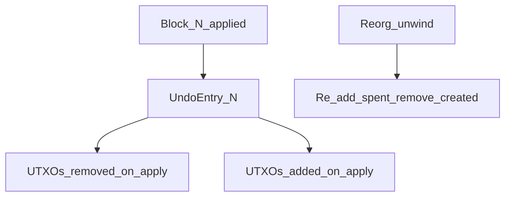

# Harpy UTXO state model

**Status:** Design gate — [GitHub #21](https://github.com/mbx30/harpy/issues/21)  
**Milestone:** [Phase 4: State model & transaction security](https://github.com/mbx30/harpy/milestone/4) (due Aug 27)  
**Linear:** [Harpy project](https://linear.app/mbx2/project/harpy-16c5704dd57d/overview)

Harpy today stores arbitrary strings in `Block#data` and mines them via `POST /new-block`. Phase 4 replaces that free-form payload with a **UTXO-based transaction model**: signed spends, a coinbase reward, mempool validation, and per-block state transitions. This document is the design gate — implementation issues [#22–#27](https://github.com/mbx30/harpy/issues) must follow it exactly.

**Scope:** educational single-node chain. Persistence of the UTXO set piggybacks on chain replay (in memory); Phase 3 storage hardening runs in parallel and is not a blocker for the in-memory model.

**Out of scope for this design:** P2P gossip, reorg execution (schema only), difficulty retargeting, production key custody.

---

## Phase 5 gate

> **Phase 5 (P2P networking, reorgs, multi-node sync) does not start until this document is reviewed, merged, and explicitly approved by the project owner.**

No Crystal code for [#22–#27](https://github.com/mbx30/harpy/issues) should land before sign-off. The undo-log schema and hash-serialization rules defined here are prerequisites for [#31 Reorg handler](https://github.com/mbx30/harpy/issues/31); changing them after Phase 4 implementation would force a redesign.

---

## 1. Decision record: UTXO over accounts

The roadmap and [security hardening research](https://app.notion.com/p/3919cb079ddb8132ae08f16afdd9f0a0) recommend **UTXO** (unspent transaction output) semantics for teaching double-spend prevention and for alignment with the Bitcoin-style tutorial lineage Harpy inherits.

| Criterion | UTXO (chosen) | Accounts (rejected for Harpy) |
|-----------|---------------|--------------------------------|
| Pedagogy | Explicit inputs/outputs; mirrors Bitcoin tutorial lineage | Simpler balances but hides spend mechanics |
| Reorg undo | Natural per-block undo log of spent/created UTXOs | Account rollback is trickier to teach and audit |
| Harpy scope | Fits educational PoW chain + future [MIC-81](https://linear.app/mbx2/issue/MIC-81) Merkle anchoring | Better suited to smart-contract platforms (Phase 7) |
| Double-spend | Each output spent at most once; conflicts are visible | Requires nonce/sequence discipline per account |
| Implementation | Map `OutPoint → TxOutput`; validate before apply | Global balance map + replay ordering rules |

**Decision:** Harpy adopts a **UTXO set** keyed by `(txid, vout_index)`. User transactions consume existing outputs and create new ones; the coinbase transaction mints the block reward plus collected fees.

### Non-goals

Harpy remains an educational tutorial, not production financial infrastructure. This design explicitly excludes:

- **Privacy** — no CoinJoin, confidential transactions, or mixing; all amounts and pubkeys are plain in JSON.
- **Native smart contracts** — no VM, no account-based contract storage (deferred to optional Phase 7).
- **Production key custody** — Ed25519 keys are for learning signatures; no HSM, multisig, or hardware-wallet integration.
- **Automatic chain migration** — existing `data/chain.json` files with `data` strings are incompatible; operators reset the chain when upgrading to Phase 4.

---

## 2. Core data structures

All types below are **JSON-serializable** Crystal structs (to be implemented in [#22](https://github.com/mbx30/harpy/issues/22)). Field names use `snake_case` to match Harpy conventions.

### OutPoint

Identifies a single UTXO.

| Field | Type | Description |
|-------|------|-------------|
| `txid` | `String` | 64-char hex SHA-256 of the canonical transaction digest (see §4) |
| `vout` | `UInt32` | Zero-based index into the parent transaction's `outputs` array |

Two `OutPoint` values are equal iff both fields match. This pair is the primary key in the UTXO set.

### TxInput

Spends one existing UTXO.

| Field | Type | Description |
|-------|------|-------------|
| `prev_out` | `OutPoint` | UTXO being consumed |
| `signature` | `String` | Hex-encoded Ed25519 signature ([#23](https://github.com/mbx30/harpy/issues/23)) |

**Signing payload:** Ed25519 signs the **transaction digest** — SHA-256 over a canonical JSON representation of the transaction **excluding** the `inputs[].signature` fields (deterministic key order, no whitespace variance). Each input's signature must verify against the **pubkey** of the UTXO being spent (`TxOutput.pubkey` at `prev_out`).

Coinbase transactions have **no inputs**; this struct appears only in user transactions.

### TxOutput

Creates a new UTXO.

| Field | Type | Description |
|-------|------|-------------|
| `amount` | `UInt64` | Value in **base units** (see §6) |
| `pubkey` | `String` | Hex-encoded Ed25519 public key (32 bytes → 64 hex chars) |

An optional `address` string (e.g. base58check of pubkey hash) may be added later for wallet ergonomics; v1 uses raw pubkey for transparency in tutorials.

### Transaction

User spend or transfer.

| Field | Type | Description |
|-------|------|-------------|
| `version` | `UInt32` | Protocol version; `1` for Phase 4 |
| `inputs` | `Array(TxInput)` | Must be non-empty for non-coinbase txs |
| `outputs` | `Array(TxOutput)` | Must be non-empty |

**Derived values (not stored):**

- `txid` — `SHA256(canonical_tx_body)` as 64-char hex.
- `fee` — `sum(input_utxo.amount for each input) − sum(output.amount)`; must be ≥ `MIN_TX_FEE` (§6) for mempool admission once [#37](https://github.com/mbx30/harpy/issues/37) is implemented; design constant is fixed now.

**Constraints:**

- At least one input and one output.
- `sum(outputs.amount) ≤ sum(inputs' referenced UTXO amounts)` (strict inequality allowed — difference is fee).
- No duplicate `prev_out` within the same transaction.
- All input UTXOs must exist in the current UTXO set (or mempool-confirmed set) at validation time.

### CoinbaseTx

Special transaction at index `0` in every block.

| Field | Type | Description |
|-------|------|-------------|
| `version` | `UInt32` | `1` |
| `outputs` | `Array(TxOutput)` | Exactly **one** output in Phase 4 |
| `height` | `UInt32` | Block height (binds coinbase to block; prevents cross-block replay) |

**No `inputs` array** — coinbase mints new value.

**`txid` derivation:** `SHA256("coinbase:" + block_hash + ":" + height)` where `block_hash` is the block header hash **after** PoW (the stored `hash` field). Computed when the block is sealed; the coinbase is included in `transactions[0]` before merkle root calculation.

**Output value:** `BLOCK_REWARD + total_fees` from user transactions in the same block (§6).

**Maturity:** Coinbase outputs are not spendable until `COINBASE_MATURITY` blocks deep ([#38](https://github.com/mbx30/harpy/issues/38)). The UTXO set tracks `created_height` internally for coinbase outputs (see below).

### UTXO set

In-memory map:

```
UTXO set : Hash(OutPoint, UtxoEntry)

UtxoEntry {
  output         : TxOutput
  created_height : UInt32   # block height that created this UTXO
  is_coinbase    : Bool
}
```

**Bootstrap:** On node start, replay the canonical chain from genesis: `apply_block` for each block in order. No separate UTXO snapshot is required for Phase 4; Phase 3 checksum/snapshot work can extend this later.

**Persistence note:** The UTXO set is derivable from `chain.json` + this spec. Storing a snapshot is an optimization, not a source of truth.

---

## 3. Block body migration

Today ([`block.cr`](../src/harpy/block.cr)):

```crystal
getter data : String
```

After Phase 4:

```crystal
getter transactions : Array(Transaction | CoinbaseTx)  # coinbase MUST be transactions[0]
getter merkle_root : String
```

| Rule | Detail |
|------|--------|
| Coinbase position | `transactions[0]` is always the coinbase; user txs follow in miner-selected order |
| Min length | Every block has at least one transaction (the coinbase) |
| Max length | `1 + MAX_TXS_PER_BLOCK` (coinbase + user txs) |
| Genesis | Genesis block contains a coinbase paying `BLOCK_REWARD` to a configured genesis pubkey (replacing the genesis `data` string) |
| Empty mempool | Miner still produces a coinbase-only block |

**Breaking change:** `Block#data` is removed, not deprecated. Existing chains on disk cannot be auto-migrated; delete `data/chain.json` and restart (documented in [DEMO.md](./DEMO.md) when Phase 4 ships).

**Merkle root:** Included in the block header from v1 (recommended for [MIC-81](https://linear.app/mbx2/issue/MIC-81) Merkle anchoring). Computed over the list of transaction `txid` values in block order (coinbase txid first). Algorithm: binary SHA-256 Merkle tree; odd leaf count duplicates the last leaf (Bitcoin-style).

---

## 4. Hash serialization breaking change

`Block#computed_hash` today digests:

```
index
timestamp
data          ← replaced
prev_hash
nonce
```

**Phase 4** replaces `data` with **`merkle_root`** (64-char hex):

```
index
timestamp
merkle_root
prev_hash
nonce
```

`difficulty` remains **outside** the hash preimage (unchanged from current behavior). `transactions` body is committed via `merkle_root` only — not serialized inline into the hash string.

**Consequences:**

- All `spec/fixtures/hash_vectors.json` vectors for the `data` era remain valid for historical reference; new fixtures are required for transaction-era blocks.
- PoW (`pow_valid?`) is unchanged: hash must start with `difficulty` leading hex zeroes.
- Any tool that recomputes `computed_hash` must implement canonical merkle root calculation identically.

**Canonical transaction digest** (for `txid` and signing):

1. JSON object with keys `version`, `inputs` (each input: `prev_out` only — no signature), `outputs`.
2. Keys sorted lexicographically; arrays preserve order; no insignificant whitespace.
3. `SHA256(utf8_bytes)` → lowercase hex `txid`.

---

## 5. State transition rules

Pure functions (names for implementers in [#24–#26](https://github.com/mbx30/harpy/issues)):

### `validate_tx(tx, utxo_set, current_height) -> Bool`

Returns `true` only if all checks pass:

1. **Structure** — `version` supported; non-empty `inputs` and `outputs`; no duplicate `prev_out`.
2. **Signatures** — for each input, Ed25519 verify: `signature` over transaction digest matches `utxo_set[prev_out].output.pubkey` ([#23](https://github.com/mbx30/harpy/issues/23)).
3. **Existence** — every `prev_out` exists in `utxo_set`.
4. **Maturity** — if `utxo.is_coinbase`, require `current_height - utxo.created_height >= COINBASE_MATURITY`.
5. **Conservation** — `sum(output.amount) + fee <= sum(referenced UTXO amounts)` where `fee = inputs_sum - outputs_sum`.
6. **Fee floor** — `fee >= MIN_TX_FEE` (reject below minimum once enforced; constant defined now).
7. **No double-spend** — inputs not already marked spent in a pending block template or conflicting mempool tx.

Coinbase transactions are **not** validated through `validate_tx`; they use `validate_coinbase` (below).

### `validate_coinbase(coinbase, block_height, fees_in_block, miner_pubkey) -> Bool`

1. Exactly one output; output `pubkey` matches `miner_pubkey`.
2. `coinbase.height == block_height`.
3. `coinbase.outputs[0].amount == BLOCK_REWARD + fees_in_block`.
4. No inputs present.

### `apply_tx(tx, utxo_set) -> { utxo_set, undo_slice }`

1. For each input: record `UtxoEntry` in `undo_slice.spent`; remove `prev_out` from set.
2. For each output at index `i`: insert `OutPoint(txid, i)` → new `UtxoEntry` (`is_coinbase: false`, `created_height: block_height`); record outpoint in `undo_slice.created`.
3. Return updated set and undo slice fragment.

**Precondition:** `validate_tx` already passed.

### `apply_block(block, utxo_set) -> { utxo_set, undo_entry }`

1. Assert `block.transactions[0]` is coinbase; user txs are `transactions[1..]`.
2. `fees = sum(tx.fee for tx in user_txs)`.
3. `validate_coinbase(coinbase, block.index, fees, miner_pubkey)`.
4. Apply coinbase: mint single UTXO (`is_coinbase: true`, `created_height: block.index`); append to `undo_entry.created`.
5. For each user tx in order: `validate_tx` then `apply_tx`; merge undo slices into `undo_entry`.
6. Return updated UTXO set and full `undo_entry` for this block (§7).

### Invariants (security test suite [#27](https://github.com/mbx30/harpy/issues/27))

| ID | Invariant |
|----|-----------|
| I1 | **Supply conservation** — except coinbase minting, `Σ outputs ≤ Σ inputs` per tx; global supply increases only by `BLOCK_REWARD` per block (fees move value, not create it). |
| I2 | **No double-spend** — no `OutPoint` appears as an input in two valid txs in the same block; mempool rejects conflicting spends. |
| I3 | **Coinbase value** — coinbase output amount equals `BLOCK_REWARD + Σ fees` of included user txs. |
| I4 | **Immutability** — spent UTXOs never reappear except via reorg undo (Phase 5). |
| I5 | **Maturity** — immature coinbase UTXOs fail `validate_tx` (spend attempt rejected). |
| I6 | **Signature binding** — tampering any signed field invalidates all input signatures. |
| I7 | **Deterministic replay** — replaying the chain from genesis yields identical UTXO set at every height. |

---

## 6. Economics constants

Tutorial defaults (Crystal constants in `Harpy::Economics` or similar):

| Constant | Value | Rationale |
|----------|-------|-----------|
| `BLOCK_REWARD` | `50_000_000` base units | Round number for demos; display as 50.0 HARPY if 6 decimal places are used in UI |
| `COINBASE_MATURITY` | `100` blocks | Matches Bitcoin pedagogy; ties to [#38](https://github.com/mbx30/harpy/issues/38) |
| `MIN_TX_FEE` | `1_000` base units | Anti-spam floor; ties to [#37](https://github.com/mbx30/harpy/issues/37) — design now, enforce in Phase 6 |
| `MAX_TXS_PER_BLOCK` | `100` user txs | Bounds block size with existing 32 KiB payload cap; coinbase excluded from count |

**Base unit:** 1 HARPY = `1_000_000` base units (micro-HARPY style) is recommended for wallet display but not required for Phase 4 code.

**Fee sink:** Fees flow to the miner via the coinbase output (no burn address in Phase 4).

**Supply:** Unlimited linear emission at `BLOCK_REWARD` per block (no halving in tutorial scope).

---

## 7. Reorg undo data schema

Single-node Harpy does not execute reorgs until Phase 5, but **implementers must record undo data on every `apply_block`** so [#31](https://github.com/mbx30/harpy/issues/31) can unwind without redesign.



### Per-block `UndoEntry`

| Field | Type | Description |
|-------|------|-------------|
| `height` | `UInt32` | Block index this entry reverses |
| `spent` | `Array({ outpoint: OutPoint, entry: UtxoEntry })` | UTXOs removed during `apply_block`; **re-insert** on undo |
| `created` | `Array(OutPoint)` | UTXOs added during `apply_block`; **delete** on undo |

**Undo algorithm** (Phase 5):

1. Pop blocks from tip down to fork point.
2. For each popped block `N` (highest first): for each `outpoint` in `created`, remove from UTXO set; for each `{outpoint, entry}` in `spent`, re-insert `entry` at `outpoint`.
3. Apply alternate fork blocks forward with fresh `apply_block` / undo generation.

**Order within `spent`:** Preserve the order outputs were consumed (reverse when undoing if needed for pedagogy; set restoration is order-independent).

**Storage:** Undo entries are keyed by `block_hash` or `height` in memory alongside the chain; Phase 5 may persist them in the chain envelope (Phase 3 versioning).

---

## 8. API migration plan

Implementation deferred to [#22–#25](https://github.com/mbx30/harpy/issues); this section defines the target HTTP surface.

| Today | Phase 4 target | Notes |
|-------|----------------|-------|
| `POST /new-block` `{ "data": "..." }` | `POST /tx` — submit signed transaction JSON | Validates against UTXO set + mempool; returns `txid` or 400 |
| (none) | `GET /mempool` | Lists pending txs (txid, fee, size) |
| `POST /new-block` mines arbitrary data | `POST /mine` | Mines block with coinbase + mempool txs; clears included txs from mempool |

**Read endpoints** (`GET /`, `GET /validate`, `GET /block/:index`) remain; block JSON shape changes to `transactions` + `merkle_root`.

### `POST /tx`

- **Body:** full `Transaction` JSON (client supplies signatures).
- **Auth:** same as writes today — `HARPY_API_KEY` when set ([#43](https://linear.app/mbx2/issue/MIC-43)).
- **Validation:** `validate_tx` against current UTXO set + mempool conflict check before admission.
- **Responses:** `200` + `{ "txid": "..." }`; `400` invalid tx; `401` unauthorized; `409` double-spend conflict.

### `GET /mempool`

- **Response:** `{ "transactions": [ ... ] }` in admission order.
- No auth required (read-only).

### `POST /mine`

- **Body:** `{ "miner_pubkey": "..." }` (hex Ed25519 pubkey for coinbase payout).
- **Auth:** required when `HARPY_API_KEY` set.
- **Rate limit:** extends current token bucket (today on `POST /new-block`) to `POST /mine` — same env vars `HARPY_RATE_LIMIT`, `HARPY_RATE_LIMIT_WINDOW`.
- **Behavior:** select up to `MAX_TXS_PER_BLOCK` txs from mempool (fee-rate ordering optional; v1 may use FIFO), build coinbase, mine PoW, `apply_block`, persist chain, return block JSON.
- **Responses:** `200` block; `422` block rejected; `429` rate limited.

**Deprecation:** `POST /new-block` with `data` field is **removed** in Phase 4 (not aliased). Tutorial docs update to `POST /tx` + `POST /mine`.

---

## 9. Implementation sequence

Ordered dependency chain for Phase 4 implementation (not part of this design sprint):

| Order | Issue | Deliverable |
|-------|-------|-------------|
| 1 | [#22](https://github.com/mbx30/harpy/issues/22) | `Transaction`, `TxInput`, `TxOutput`, `OutPoint`, `CoinbaseTx` structs + JSON |
| 2 | [#23](https://github.com/mbx30/harpy/issues/23) | Ed25519 sign/verify over transaction digest |
| 3 | [#24](https://github.com/mbx30/harpy/issues/24) | `Mempool` + `validate_tx` at API boundary |
| 4 | [#25](https://github.com/mbx30/harpy/issues/25) | Miner builds block from mempool; `merkle_root` in header |
| 5 | [#26](https://github.com/mbx30/harpy/issues/26) | Coinbase reward + fee aggregation; `apply_block` |
| 6 | [#27](https://github.com/mbx30/harpy/issues/27) | Security tests: double-spend, bad sig, insufficient balance |

**Parallel track (non-blocking):** Phase 3 storage — atomic writes, checksum envelope ([#16–#18](https://github.com/mbx30/harpy/issues)) — can proceed alongside Phase 4; UTXO set remains replay-derived.

**Blocked until this doc is approved:** Phase 5 [#28+](https://github.com/mbx30/harpy/issues) (P2P, orphans, reorg handler, multi-node tests).

---

## Related documents

- [THREAT_MODEL.md](./THREAT_MODEL.md) — double-spend and unauthorized-write threats
- [DEMO.md](./DEMO.md) — runbook (to be updated when Phase 4 API ships)
- [AGENTS.md](../AGENTS.md) — architecture and commands
- [GitHub #21](https://github.com/mbx30/harpy/issues/21) — design gate issue
- [MIC-81](https://linear.app/mbx2/issue/MIC-81) — future Merkle anchoring API
